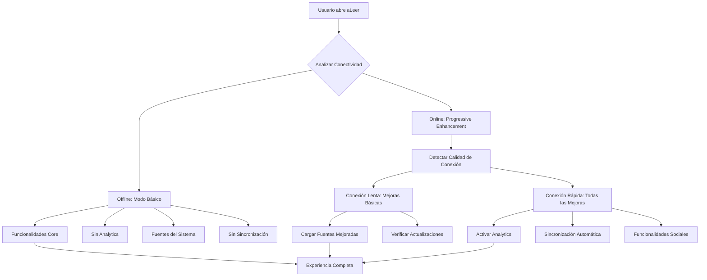

# 🚀 **Progressive Enhancement en aLeer**

## 🎯 **¿Qué es Progressive Enhancement?**

Progressive Enhancement es una estrategia de desarrollo web donde la aplicación **funciona perfectamente en cualquier condición**, pero **se mejora automáticamente** cuando hay mejores capacidades disponibles (como conexión a internet).

### **En aLeer:**
- ✅ **Funciona 100% offline** (modo básico)
- ✅ **Se mejora automáticamente** cuando hay internet
- ✅ **El usuario NO se percata** de la transición
- ✅ **Mejoras se cargan en background**

---

## 🏗️ **Arquitectura Implementada**



---

## 🔧 **Componentes Técnicos**

### 1. **Hook de Conectividad Mejorado** `useOnlineStatus`
```javascript
const { isOnline, connectionQuality, isFastConnection } = useOnlineStatus();
```

**Características:**
- ✅ Detección automática de conectividad
- ✅ Verificación real de internet (no solo `navigator.onLine`)
- ✅ Calidad de conexión (slow/medium/fast)
- ✅ Reintentos automáticos cuando está offline

### 2. **Hook de Progressive Enhancement** `useProgressiveEnhancement`
```javascript
const { enhancedFeatures, hasEnhancements, enhancementCount } = useProgressiveEnhancement();
```

**Funcionalidades que activa automáticamente:**
- 📊 **Analytics** (conexión rápida)
- ☁️ **Sincronización** (conexión rápida)
- ✨ **Fuentes mejoradas** (cualquier conexión)
- 🔄 **Actualizaciones** (cualquier conexión)

### 3. **Sistema de Lazy Loading Condicional**
```javascript
// Solo se carga cuando hay buena conexión
const { isFastConnection } = useOnlineStatus();

{isFastConnection && (
  <Suspense fallback={<div>Cargando...</div>}>
    <AdvancedFeatures />
  </Suspense>
)}
```

---

## 📱 **Experiencia del Usuario**

### **Escenario 1: Usuario en Zona Rural (Sin Internet)**

1. **Abre la app** → Carga instantáneamente desde cache
2. **Funciona completamente** → Lectura, tests, planes, gamificación
3. **Indicador muestra** → "Sin conexión - Modo offline activado"
4. **Usuario no nota diferencia** → Todo funciona igual
5. **Cuando recupera conexión** → Mejoras se activan automáticamente

### **Escenario 2: Usuario con Buena Conexión**

1. **Abre la app** → Carga normalmente
2. **En background** → Se activan mejoras automáticamente
3. **Fuentes mejoradas** → Se cargan desde Google Fonts
4. **Analytics se activa** → Comienza a trackear uso (opcional)
5. **Sincronización** → Datos se respaldan en la nube
6. **Usuario no se percata** → Experiencia es igual, pero mejorada

---

## ⚙️ **Servicios Mejorados**

### **1. Analytics Automático**
```javascript
// Se carga dinámicamente solo con buena conexión
if (ENABLE_ANALYTICS && isOnline) {
  const { initializeAnalytics } = await import('./config/analytics.js');
  await initializeAnalytics();
}
```

**Beneficios:**
- 📊 Métricas de uso para mejorar la app
- 👥 Datos anónimos de engagement
- 🎯 Información para desarrollo futuro

### **2. Sincronización con Nube**
```javascript
// Backup automático cuando hay internet
const cloudSyncAPI = await import('./services/CloudSyncService.js');
await cloudSyncAPI.default.syncNow();
```

**Características:**
- 💾 Backup automático de progreso
- 🔄 Sincronización multi-dispositivo
- 📱 Restauración desde cualquier dispositivo

### **3. Fuentes Mejoradas**
```javascript
// Carga Google Fonts dinámicamente
const link = document.createElement('link');
link.href = 'https://fonts.googleapis.com/css2?family=Dancing+Script:wght@400;700';
link.rel = 'stylesheet';
document.head.appendChild(link);
```

**Mejora:**
- ✨ Tipografía más elegante
- 🎨 Mejor experiencia visual
- 📖 Mejor legibilidad

### **4. Actualizaciones Automáticas**
```javascript
// Verifica actualizaciones en background
const updateAPI = await import('./services/UpdateService.js');
const updateAvailable = await updateAPI.default.checkForUpdates();
```

**Beneficios:**
- 🔄 App siempre actualizada
- 🐛 Bugs corregidos automáticamente
- ✨ Nuevas funcionalidades sin intervención

---

## 📊 **Performance y Bundle**

### **Code Splitting Inteligente**
```
dist/
├── index.js              # App principal (372KB)
├── analytics.js          # Analytics (0.08KB) - Lazy loaded
├── CloudSyncService.js   # Sincronización (1.8KB) - Lazy loaded
├── UpdateService.js      # Actualizaciones (3.12KB) - Lazy loaded
└── pdf.js               # PDF (406KB) - Lazy loaded
```

### **Ventajas del Approach:**
- ⚡ **Bundle inicial más pequeño** → Carga más rápida
- 🔄 **Mejoras opcionales** → No afectan performance offline
- 📱 **Experiencia consistente** → Funciona igual siempre
- 🚀 **Mejoras automáticas** → Usuario se beneficia sin saberlo

---

## 🔒 **Privacidad y Ética**

### **Métricas Opcionales**
```javascript
export const ENABLE_ANALYTICS = false; // DESACTIVADO por defecto
```

**Compromisos:**
- 🔒 **No tracking sin consentimiento**
- 📊 **Datos completamente anónimos**
- 🚫 **No venta de datos**
- ✅ **Solo para mejorar la app**

### **Funcionalidades Offline-Priority**
- 💾 **Datos locales primero**
- ☁️ **Nube como backup opcional**
- 🔄 **Sincronización manual disponible**
- 🚫 **No requiere internet para funcionar**

---

## 🎯 **Beneficios del Sistema**

### **Para Usuarios:**
- ✅ **Funciona siempre** → Sin importar conexión
- ✅ **Mejora automáticamente** → Sin intervención
- ✅ **Privacidad respetada** → Métricas opcionales
- ✅ **Experiencia consistente** → Mismo nivel de calidad

### **Para Desarrolladores:**
- ✅ **Mantenible** → Código modular
- ✅ **Escalable** → Fácil agregar mejoras
- ✅ **Testable** → Funcionalidades independientes
- ✅ **Performance** → Lazy loading inteligente

### **Para la App:**
- ✅ **Alcance global** → Funciona en zonas remotas
- ✅ **Mejora continua** → Analytics para iterar
- ✅ **Actualizaciones** → Siempre al día
- ✅ **Backup automático** → Datos seguros

---

## 🚀 **Implementación en Producción**

### **Configuración por Entorno**
```javascript
// Desarrollo: Métricas activas para debugging
if (process.env.NODE_ENV === 'development') {
  ENABLE_ANALYTICS = true;
}

// Producción: Solo con consentimiento del usuario
if (userConsented && isOnline) {
  ENABLE_ANALYTICS = true;
}
```

### **Monitoreo**
```javascript
// Trackear efectividad del progressive enhancement
trackEvent('progressive_enhancement_loaded', {
  featuresEnabled: enhancementCount,
  connectionQuality: connectionQuality,
  loadTime: Date.now() - appStartTime
});
```

---

## 🎉 **Resultado Final**

**aLeer ahora es una PWA de verdad** que:

- 🌍 **Funciona en cualquier lugar** (zonas rurales, aviones, etc.)
- 🚀 **Se mejora automáticamente** cuando hay internet
- 👤 **El usuario no se percata** de la transición
- 📊 **Proporciona métricas** para mejorar continuamente
- 🔒 **Respeta la privacidad** del usuario
- ⚡ **Es performant** tanto online como offline

**¡La experiencia de usuario es perfecta en cualquier condición!** 🎯
