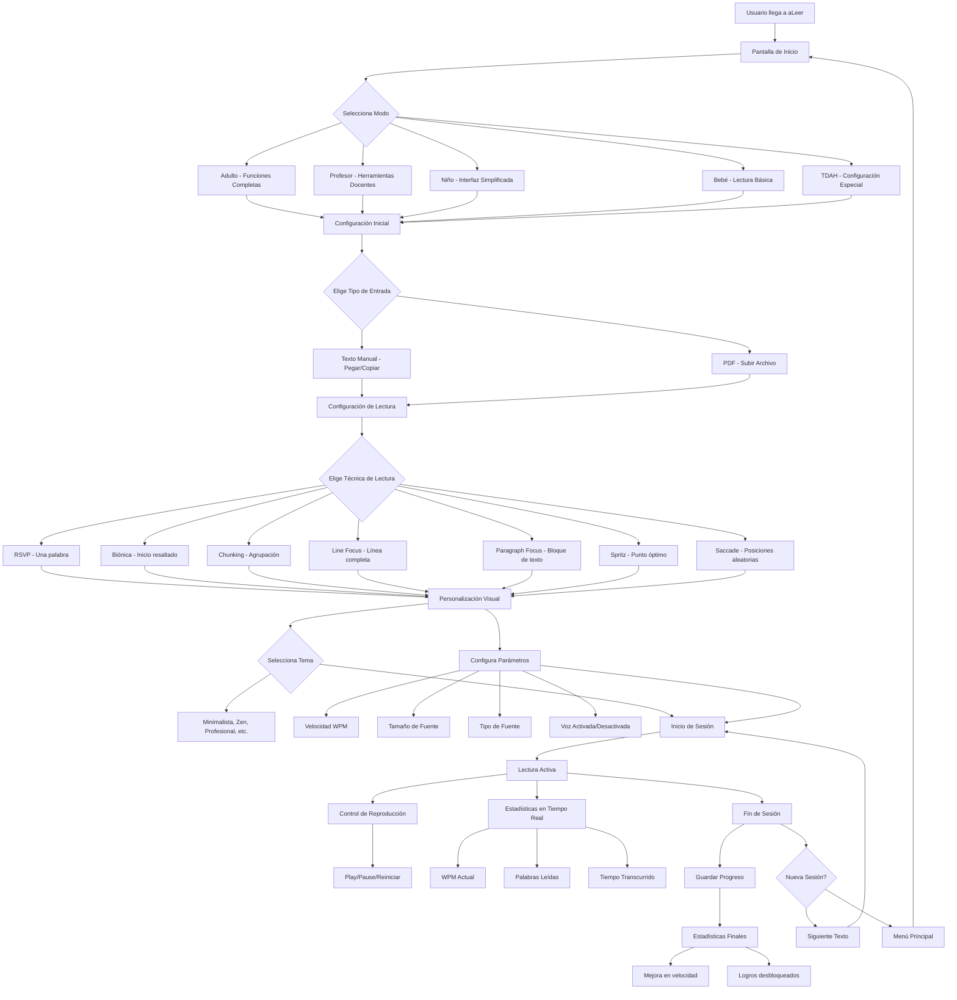
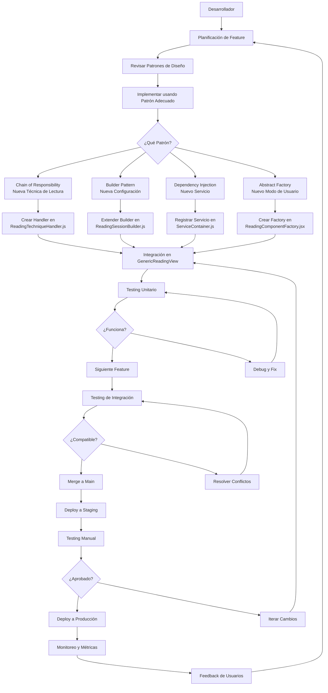
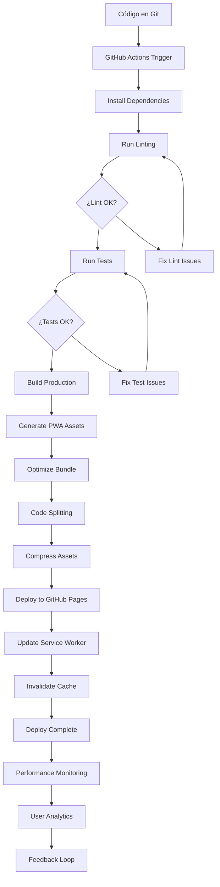
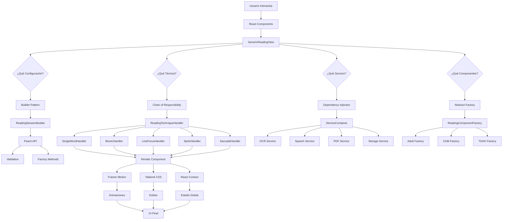

# 🚀 Workflow Completo de aLeer

## 📋 Tabla de Contenidos
- [Workflow del Usuario Final](#workflow-del-usuario-final)
- [Workflow de Desarrollo](#workflow-de-desarrollo)
- [Workflow de Build y Deploy](#workflow-de-build-y-deploy)
- [Workflow de Arquitectura Técnica](#workflow-de-arquitectura-técnica)

---

## 👤 Workflow del Usuario Final



### 🎯 Flujo Principal de Lectura
1. **Selección de Modo** → Adaptado al usuario (adulto, niño, profesor, etc.)
2. **Entrada de Contenido** → Texto manual o PDF con OCR
3. **Configuración** → Técnica, tema, velocidad, fuente
4. **Lectura Activa** → Técnicas especializadas con métricas
5. **Progreso** → Estadísticas, logros, persistencia

---

## 💻 Workflow de Desarrollo



### 🛠️ Entorno de Desarrollo
- **Local**: `npm run dev` → Servidor Vite con hot reload
- **Testing**: Jest + Testing Library para componentes
- **Linting**: ESLint con reglas de React
- **Performance**: Lighthouse + Web Vitals

---

## 🏗️ Workflow de Build y Deploy



### 📦 Scripts Disponibles
```bash
# Desarrollo
npm run dev              # Servidor local con hot reload
npm run lint             # Verificación de código
npm run preview          # Vista previa del build

# Build y Deploy
npm run build            # Build de producción
npm run deploy           # Deploy a GitHub Pages

# Testing y Performance
npm run test:perf        # Tests de performance
npm run monitor:perf     # Monitor en desarrollo
```

### 🚀 Configuración de Build
- **Base Path**: `/aileer-lectura-accesible/` (GitHub Pages)
- **Code Splitting**: React, UI, Utils separados
- **PWA**: Service Worker con precaching inteligente
- **Optimizaciones**: Minificación, compresión, tree-shaking

---

## 🏛️ Workflow de Arquitectura Técnica



### 🎨 Patrones de Diseño Implementados

#### 1. **Chain of Responsibility** 📋
- **Propósito**: Manejar diferentes técnicas de lectura
- **Beneficio**: Fácil agregar nuevas técnicas sin modificar código existente
- **Uso**: `ReadingTechniqueHandler.js`

#### 2. **Builder Pattern** 🏗️
- **Propósito**: Construir configuraciones complejas de sesión
- **Beneficio**: API fluida, validación automática, factory methods
- **Uso**: `ReadingSessionBuilder.js`

#### 3. **Dependency Injection** 💉
- **Propósito**: Gestionar servicios del sistema
- **Beneficio**: Testable, desacoplado, configurable
- **Uso**: `ServiceContainer.js`

#### 4. **Abstract Factory** 🏭
- **Propósito**: Crear familias de componentes por modo de usuario
- **Beneficio**: Consistencia, adaptación por perfil
- **Uso**: `ReadingComponentFactory.jsx`

---

## 📊 Métricas y Monitoreo

### 🔍 Performance Metrics
- **Core Web Vitals**: LCP, FID, CLS
- **Bundle Size**: Monitoreo de tamaño de chunks
- **Memory Usage**: Control de memoria en PWA
- **Service Worker**: Cache hit rates

### 📈 Analytics
- **User Sessions**: Duración, frecuencia
- **Technique Usage**: Popularidad de técnicas
- **Conversion Rates**: De visitante a usuario activo
- **Error Rates**: Fallos por técnica/modo

### 🔧 Maintenance
- **Automated Testing**: GitHub Actions CI/CD
- **Code Quality**: ESLint + Prettier
- **Bundle Analysis**: Webpack Bundle Analyzer
- **Dependency Updates**: Dependabot

---

## 🎯 Próximos Pasos en el Workflow

1. **Q1 2025**: Implementar IA para recomendaciones personalizadas
2. **Q2 2025**: Sistema de gamificación avanzado con logros
3. **Q3 2025**: Integración con plataformas de e-learning
4. **Q4 2025**: App móvil nativa

---

*Workflow creado para aLeer - Entrenador de Lectura Avanzada* 🚀

